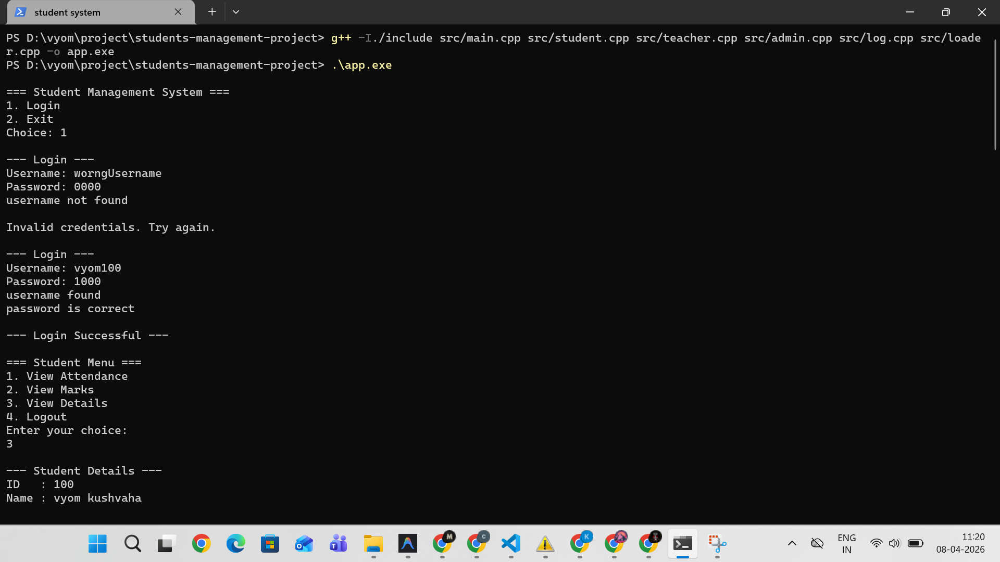
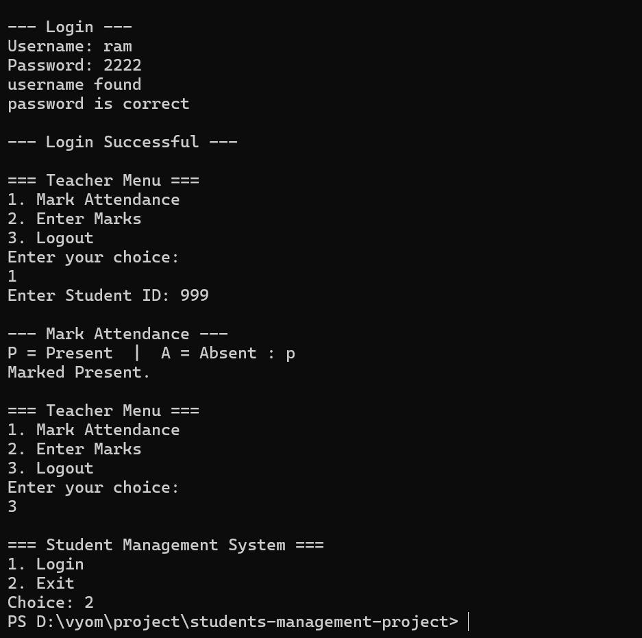
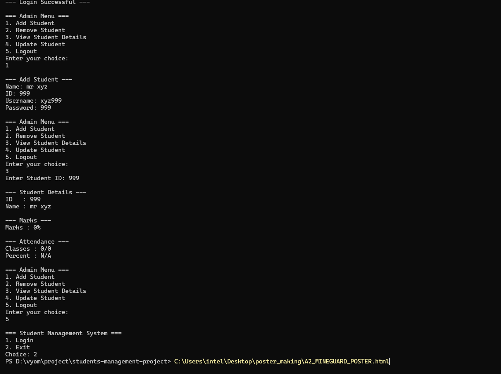

# 🎓 Student Management System (C++)


---

## 📌 Description

This is a **console-based Student Management System** built in C++ as a **learning project** to learn OOP, file handling, and how system work.

The project focuses on simulating a simple academic system with role-based access:

* Student
* Teacher
* Admin

> ⚠️ This is my **first project**, so it is not perfect. Some features are implemented and some are planned for future improvement.

---

## 🚀 Features (Implemented)

### 🔐 Authentication System
* Role-based login (Student / Teacher / Admin)
* Username & password validation using file data (`stupass.txt`)
* Basic login error handling
* **Dynamic Credential Syncing:** Adding or removing a student automatically updates the authentication database.

### 👨‍🎓 Student Features
* View personal details (ID, Name)
* View marks
* View attendance
* Menu-driven interface
* Loop-based navigation until logout

### 👨‍🏫 Teacher Features
* Mark student attendance (Present / Absent)
* Enter/update student marks
* Basic validation for input

### 🛠️ Admin Features
* Add new student (auto-generates login credentials)
* Remove student (auto-deletes login credentials and syncs file dataset indexes)
* View all student details
* Update student names and marks

### 📂 File Handling
* Data stored in text files (`students.txt`, `teachers.txt`, `admins.txt`, `stupass.txt`)
* Read/write operations using `fstream`
* Manual string syntax parsing

### 🧠 OOP Concepts Used
* Classes and Objects
* Constructor overloading
* Header (`.h`) & source (`.cpp`) file separation
* Basic modular design

---

## ⚙️ Project Structure

```text
students-management-project/
├── src/                  # Source Code
│   ├── main.cpp          # Entry point & role-based routing loop
│   ├── admin.cpp         # Admin operations (Add/Remove/Update students + File synchronization)
│   ├── student.cpp       # Student viewer operations
│   ├── teacher.cpp       # Teacher assignment operations
│   ├── log.cpp           # Custom logic for file reading and authentication
│   └── loader.cpp        # Pre-loads .txt files into memory vectors
├── include/              # Header declarations for all source classes
├── data/                 # Text-based database files
│   ├── students.txt      # Primary student details
│   ├── teachers.txt      # Teacher references
│   ├── admins.txt        # Admin references
│   └── stupass.txt       # Combined login credentials and role definitions
└── README.md             # Project Documentation

---

## ▶️ How to Run

```bash
# Clone the repository
git clone https://github.com/vyom-kushvaha/students-management-project.git

# Move into project root directory
cd students-management-project

# Compile the source files
g++ -I./include src/main.cpp src/student.cpp src/teacher.cpp src/admin.cpp src/log.cpp src/loader.cpp -o app

# Run
./app
```
*(Note: Always run the executable from the project root directory so it can locate the `data/` folder correctly.)*

---

## 🖥️ Sample Output

<p align="center">
  
</p>

<p align="center">
  
</p>

<p align="center">
  
</p>

---

## ❗ Current Limitations

* Limited input validation (invalid input/symbols may break the execution flow)
* File overwrite logic is basic and parsing is entirely manual with `while()` loops
* Admin cannot add or remove other Teachers/Admins (only Students are supported)
* Error handling is minimal

---

## 🧪 Planned / Future Features

* Proper file update logic using structured data types (e.g. `<sstream>` or JSON)
* Search student by exact ID rather than vector indexes
* Multi-subject marks array instead of single total marks
* Advanced input validation to prevent crashes from typos
* Cleaner formatted UI within the console
* Possible GUI version (future upgrade)

---

## 🧩 Challenges Faced

* Managing state synchronization when vector arrays shift after a `remove` operation
* Parsing structured textual data manually from CSV formats
* Designing multi-class interactions across Student, Teacher, and Admin domains
* Debugging infinite loop bugs when reading files and rewriting datasets

---

## 📈 What I Learned

* Real use of C++ in building dynamic systems
* Complex file handling (`fstream`, reading, array logic, overwriting)
* Structuring projects correctly with separate Header (`.h`) and Implementation (`.cpp`) files
* Debugging logical memory synchronization vs disk writing
* Thinking in terms of architecture and memory state rather than just simple algorithms

---

## 📊 Project Status

🟡 In Progress — continuously improving

---

## 👨‍💻 Author

**Vyom Kushvaha**
B.Tech IT (First Year)
Learning Programming | Exploring AI & Cybersecurity

---

## 💬 Final Note

This project is part of my learning journey.
It may not be perfect, but every feature added and every bug fixed helped me understand programming better.
